# 1132 DATABASE

# 目錄
### HW1
* [程式碼](https://github.com/PhoebeLu1011/1132database/blob/main/DatatreatAgentAutogen.py)
* [架構圖](#架構圖)
* [抽換數據](#抽換數據)
* [AIAGENT種類的使用](#AIAGENT的使用)

### HW2-DRai
* [程式碼](https://github.com/PhoebeLu1011/1132database/blob/main/DRai.py)
* [架構圖](#程式架構圖)
* [數據](#數據)
* [程式碼執行截圖](#程式碼執行)

### HW3-postAI
* [程式碼](https://github.com/PhoebeLu1011/1132database/blob/main/HW3_POSTAI.py)
* [架構圖](#程式碼架構圖)
* [程式碼執行截圖](#程式碼執行截圖)

### HW4-AI飲食與運動訓練建議生成器
* [說明](#HW4-AI飲食菜單與運動訓練建議生成器)
* [程式碼](https://github.com/PhoebeLu1011/1132database/blob/main/hw4%20final.py)
* [輸出的PDF檔案](https://github.com/PhoebeLu1011/1132database/blob/main/health_plan_20250429_225108.pdf)
* [程式碼執行截圖](#程式碼截圖與操作)

### HW5
* 程式碼
[app.py]()
[index.html]()
[ai.py]()


## HW1—復健建議機器人
### 架構圖
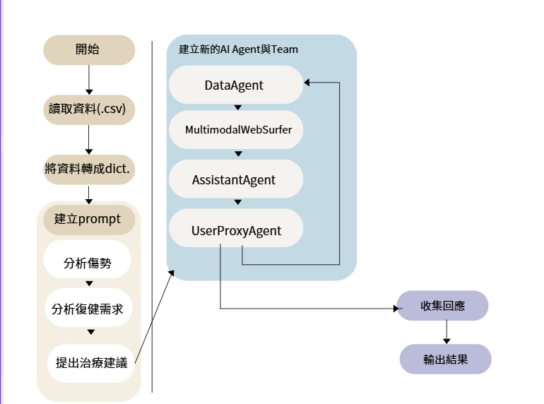

### 抽換數據

| PatientID | Name         | Age | Gender | InjuryType       | Severity | MRI_Result           | XRay_Result          | Blood_Test_Result           | Recommended_Treatment                  |
|-----------|-------------|-----|--------|------------------|----------|----------------------|----------------------|-----------------------------|----------------------------------------|
| 1         | John Doe    | 45  | M      | ACL Tear         | Severe   | Complete tear        | Normal               | Normal                      | Physical therapy, possible surgery    |
| 2         | Jane Smith  | 32  | F      | Fractured Wrist  | Moderate | No abnormalities     | Fracture on radius   | Normal                      | Cast immobilization, pain management  |
| 3         | Michael Lee | 28  | M      | Concussion       | Mild     | No abnormalities     | Normal               | Elevated white blood cells  | Rest, cognitive therapy               |
| 4         | Sarah Kim   | 60  | F      | Hip Arthritis    | Severe   | Cartilage degeneration | Normal               | Normal                      | Physical therapy, pain management     |
| 5         | David Brown | 50  | M      | Rotator Cuff Tear | Moderate | Partial tear         | Normal               | Normal                      | Strength training, possible surgery   |
| 6         | Emily White | 40  | F      | Herniated Disc   | Severe   | Disc protrusion      | Normal               | Normal                      | Physical therapy, spinal injections   |
 
### AIAGENT的使用

DataAgent : 負責處理與整理數據。\
MultimodalWebSurfer : 透過網路搜尋最新的復健與治療資訊。\
Assistant : 提供初步治療建議。\
UserProxy : 模擬使用者，協助溝通。

```
from autogen_agentchat.agents import AssistantAgent, UserProxyAgent
from autogen_agentchat.conditions import TextMentionTermination
from autogen_agentchat.teams import RoundRobinGroupChat
from autogen_agentchat.messages import TextMessage
```


本作業是利用 RoundRobinGroupChat 將四個代理人（DataAgent、MultimodalWebSurfer、Assistant 與 UserProxy）組成團隊並協作對話，分批處理 CSV 資料，並要求 MultimodalWebSurfer 搜尋外部網站，納入最新的復健治療建議資訊，最終將所有對話內容整合並輸出為 CSV。

## 功能介紹

透過 RoundRobinGroupChat 機制，讓多個AI Agents合作完成任務：

1.使用 pandas 讀取病患復健數據，並分批處理。

2.利用多個AI Agent來合作處理病患病歷。

3.將分析結果存成 .CSV 檔案輸出。


## 程式碼

1.載入 Python 模組
```
import os
import asyncio
import pandas as pd
from dotenv import load_dotenv
import io
```
2.匯入Autogen 的 AI Agents
```
from autogen_agentchat.agents import AssistantAgent, UserProxyAgent
from autogen_agentchat.conditions import TextMentionTermination
from autogen_agentchat.teams import RoundRobinGroupChat
from autogen_agentchat.messages import TextMessage
```

3.process_chunk 函式

負責處理單一批次資料，並執行AI Agent。

(1) 轉換資料格式

將 CSV 讀取的 DataFrame 轉換為dict格式。

` hunk_data = chunk.to_dict(orient='records') `


(2) 建立Prompt

生成目前處理的資料範圍、復健分析請求，以及請求 MultimodalWebSurfer 代理人進行網路搜尋的提示。
```
prompt = (
    f"目前正在處理第 {start_idx} 至 {start_idx + len(chunk) - 1} 筆資料（共 {total_records} 筆）。\n"
    f"以下為該批次資料:\n{chunk_data}\n\n"
    "請根據以上資料進行分析，並提供完整的復健治療建議。"
    "其中請特別注意：\n"
    "  1. 分析傷者的傷勢與治療復健需求；\n"
    "  2. 請 MultimodalWebSurfer 搜尋外部網站，找出最新的相關症狀治療建議資訊，\n"
    "     並將搜尋結果整合進回覆中；\n"
    "  3. 最後請提供具體的建議和相關參考資訊，並且如果有相關網站連結請提供。\n"
    "請各代理人協同合作，提供一份完整且具參考價值的建議。"
)
```

(3) 初始化代理人

為每個批次建立新的 AI Agent，確保能夠一同合作並有效處理任務。
```
local_data_agent = AssistantAgent("data_agent", model_client)
local_web_surfer = MultimodalWebSurfer("web_surfer", model_client)
local_assistant = AssistantAgent("assistant", model_client)
local_user_proxy = UserProxyAgent("user_proxy")
```
(4) 建立Team並執行

使用 RoundRobinGroupChat，讓代理人輪流處理任務，直到滿足終止條件。
```
local_team = RoundRobinGroupChat(
    [local_data_agent, local_web_surfer, local_assistant, local_user_proxy],
    termination_condition=termination_condition
)
```
(5) 收集回應
```
messages = []
async for event in local_team.run_stream(task=prompt):
    if isinstance(event, TextMessage):
        print(f"[{event.source}] => {event.content}\n")
        messages.append({
            "batch_start": start_idx,
            "batch_end": start_idx + len(chunk) - 1,
            "source": event.source,
            "content": event.content,
            "type": event.type,
            "prompt_tokens": event.models_usage.prompt_tokens if event.models_usage else None,
            "completion_tokens": event.models_usage.completion_tokens if event.models_usage else None
        })
return messages
```

4.main 函式

(1) 讀取環境變數並初始化模型用戶端
```
gemini_api_key = os.environ.get("GEMINI_API_KEY")
if not gemini_api_key:
    print("請檢查 .env 檔案中的 GEMINI_API_KEY。")
    return

model_client = OpenAIChatCompletionClient(
    model="gemini-2.0-flash",
    api_key=gemini_api_key,
)
```
(2) 使用 pandas 以 chunksize 方式讀取 CSV
```
csv_file_path = "rehabilitation_patient_data.csv"
chunk_size = 1000
chunks = list(pd.read_csv(csv_file_path, chunksize=chunk_size))
total_records = sum(chunk.shape[0] for chunk in chunks)
```
3. 利用 map 與 asyncio.gather同時處理批次
```
tasks = list(map(
    lambda idx_chunk: process_chunk(
        idx_chunk[1],
        idx_chunk[0] * chunk_size,
        total_records,
        model_client,
        termination_condition
    ),
    enumerate(chunks)
))

results = await asyncio.gather(*tasks)
```

(4) 將結果存成 CSV，輸出對話紀錄
```
all_messages = [msg for batch in results for msg in batch]
df_log = pd.DataFrame(all_messages)
output_file = "all_conversation_log.csv"
df_log.to_csv(output_file, index=False, encoding="utf-8-sig")
print(f"已將所有對話紀錄輸出為 {output_file}")
```
(5)結果輸出

最終生成的 all_conversation_log.csv 包含:
每個病患的復健分析與建議、最新搜尋到的復健治療方法。

## HW2-復健對話分析系統 
根據復健治療的評分項目，把每段治療師與患者的對話，透過 Gemini API 分析後，自動標上對應的評分結果，並儲存到新的 CSV 檔案。
### 數據
* 數據導入: 
[導入數據](https://github.com/PhoebeLu1011/1132database/blob/main/113week5.csv)
(113week5.csv)
* 數據導出: 
[導出數據](https://github.com/PhoebeLu1011/1132database/blob/main/113_batch.csv)
(113_batch.csv)

### 程式架構圖

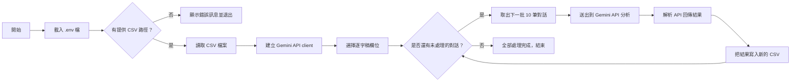

### 程式碼執行
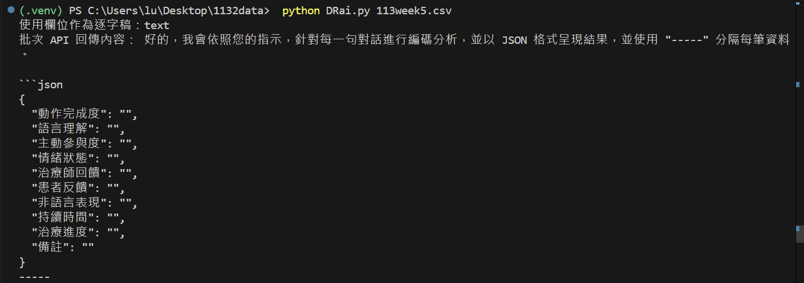
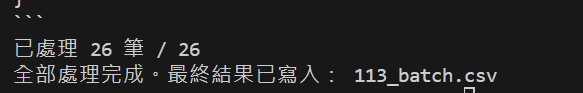
## HW3—TIMETREE行事曆
此作業使用 Playwright 自動登入 TimeTree，搜尋指定行事曆並截圖紀錄過程。
帳號密碼從 .env 環境變數讀取，保護個資安全。
### 程式碼架構圖
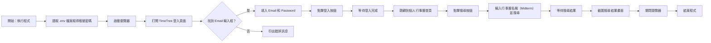
### 程式碼執行截圖
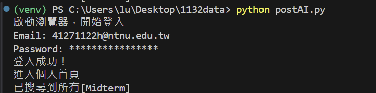
* 登入畫面\
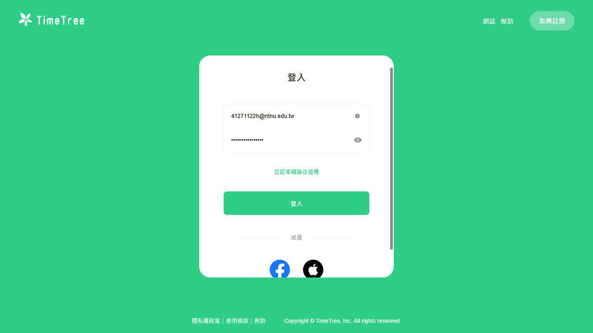
* 日曆畫面
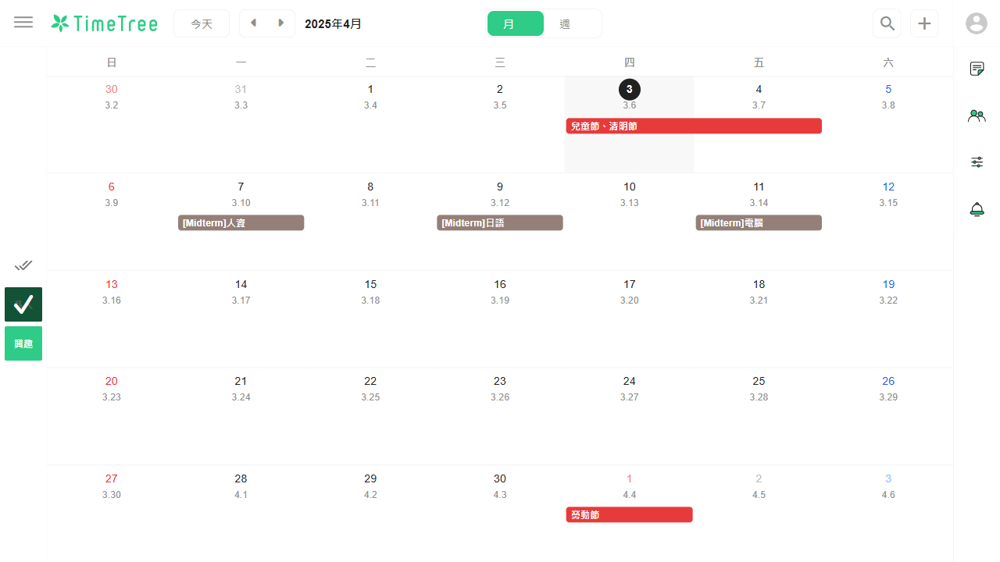
* 尋找目標畫面
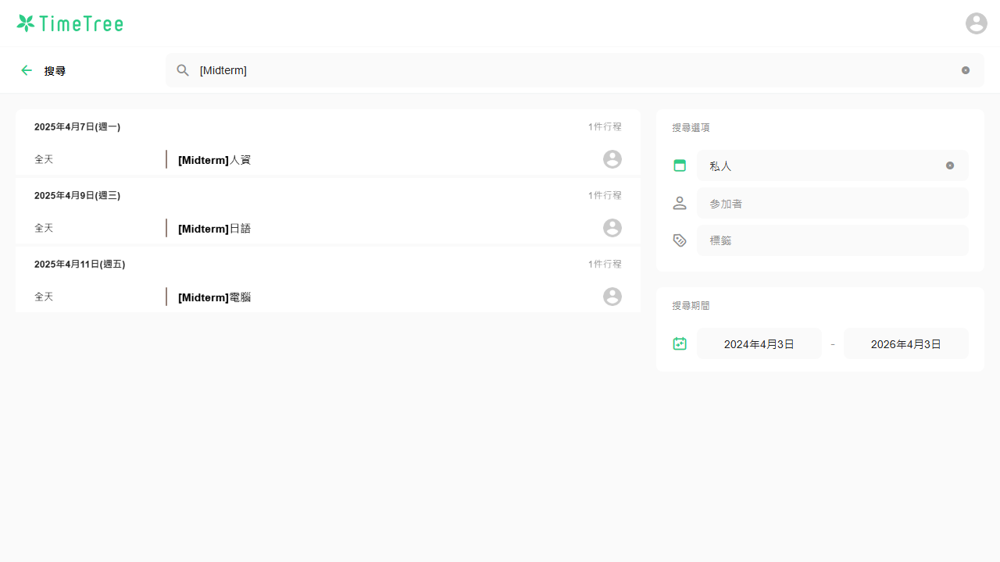


## HW4-AI飲食菜單與運動訓練建議生成器
本作業結合 Gradio、Google Gemini AI、Playwright 與 FPDF，設計一個可以分析健康資料、AI生成未來幾日的飲食與訓練建議，並匯出 PDF 或利用Playwright自動登入，讓使用者將所需資訊填入 Google Keep 中。

1. 功能說明 :\
(1) 健康資料分析：上傳 CSV 資料，由 AI 自動分析飲食與運動問題\
(2)  建議內容生成：根據資料產出一天三餐與一週運動菜單\ 
(3)  PDF 匯出：將 AI 輸出的建議內容，轉為PDF檔 \
(4)  Google Keep 自動登入：透過 Playwright，自動登入 Google 帳戶並打開 Keep 頁面，使使用者能快速記錄

2. 使用技術與套件:\
(1) Gradio：建立前端介面\
(2) Google Gemini 2.5 Pro API：自然語言處理與建議生成\
(3) Playwright：自動化操作 Google登入介面與導向 Google Keep\
(4) FPDF：將AI建議內容生成PDF檔案

3. 系統操作流程 : \
(1) 資料輸入：上傳 CSV 檔案\
(2) AI 分析：點選「 AI 分析並建議」按鈕，生成飲食菜單與運動訓練建議\
(3) 結果輸出： 點選「下載為PDF」按鈕，下載建議內容為PDF檔案，或點選「自動填入 Google Keep」按鈕，會透過playwright登入google keep，使用者須將內容輸入至 Google Keep中

#### 程式碼截圖與操作\
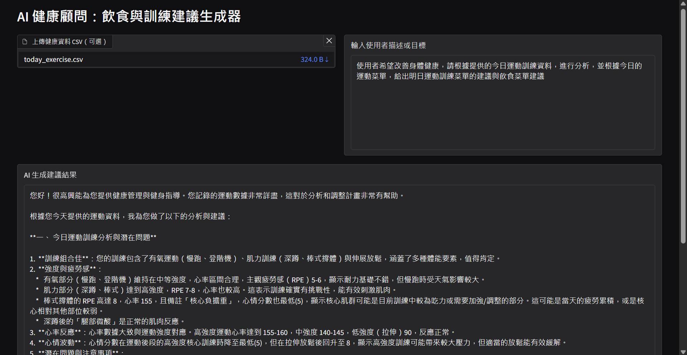
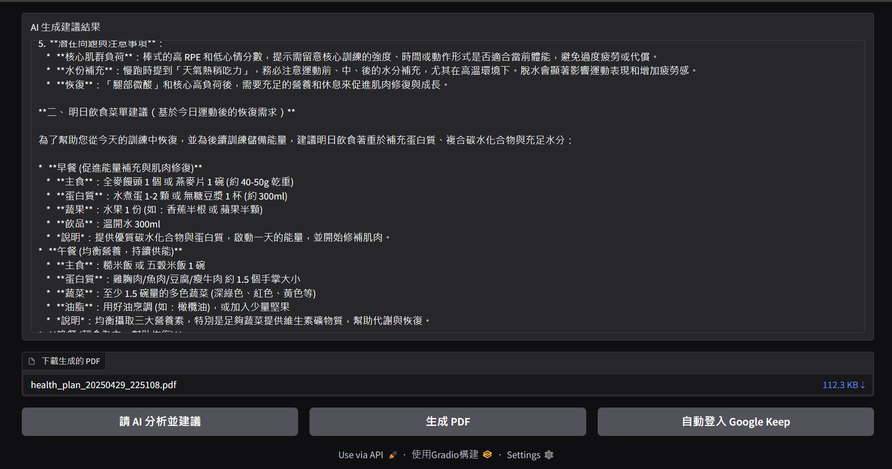


  


